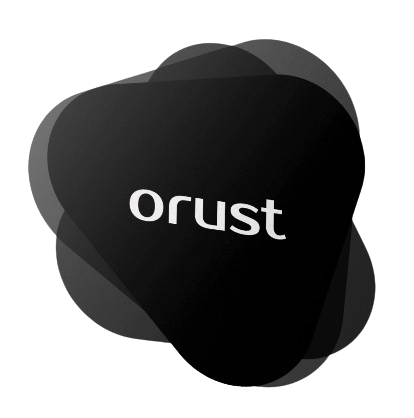

  

##
This is a baremetal operating system that can boot off of a USB stick on any BIOS-compatible machine, which is pretty amazing. I'm going to be running the Operating System using QEMU instead of booting a physical machine. Just to keep things simple. If you have questions or would love to join us, visit our [Discord](https://discord.gg/c4NTzghHpA), start a [Discussions](https://github.com/orust-org/orust-OS/discussions) or open an issue.

##### <a href="https://github.com/Blindspot22">Enow Scott</a>

## How to Install.

Visit the [Installation Manual](https://github.com/orust-org/orust-OS/blob/main/docs/Installation-Manual.md) for guidance on how to Install and run Orust

## Understanding!
For a more detailed comprehendsion of how things work, visit our [Docs](https://github.com/orust-org/orust-OS/tree/main/docs)

## License

This project, is licensed under either of the

  . Apache License, Version 2.0 (LICENSE-APACHE or https://www.apache.org/licenses/LICENSE-2.0)
  
  . MIT license (LICENSE-MIT or https://opensource.org/licenses/MIT)

at your option.
